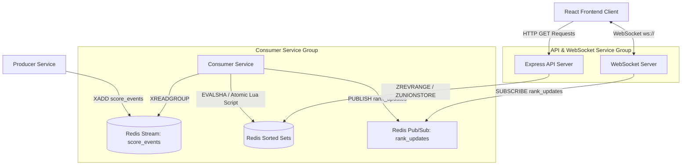

# Real-Time Gaming Leaderboard System

A complete, production-quality, real-time gaming leaderboard system built using Redis Sorted Sets, Redis Streams, Lua scripting, Express/TypeScript backends, WebSockets, and React.

---

## 🏗️ Architecture & Data Flow

The system consists of five main components:
1. **Producer Service:** Simulates gaming traffic by writing score increment events into a Redis Stream.
2. **Redis (Data Store & Event Hub):** Holds the Redis Stream (`score_events`), Pub/Sub channel (`rank_updates`), and sorted sets for global, country, and daily leaderboards.
3. **Consumer Service:** Subscribes to the stream, processes events atomically using a Lua script, updates sorted sets, and publishes rank-crossing events.
4. **API & WebSocket Service:** Exposes REST endpoints to query the leaderboards and runs a WebSocket server to broadcast real-time rank updates to clients.
5. **Frontend Client:** React-based dashboard displaying live ranks and scores with dynamic animations.

### System Architecture Diagram



---

## ⚙️ How the Application Works

1. **Event Generation:** The **Producer** selects a user from a pool of 500 users (skewing 95% of traffic to existing users and 5% to new users to simulate organic growth). It calculates a skewed score (90% chance of 1–20 points, 10% chance of 21–200 points) and publishes the event to Redis:
   ```bash
   XADD score_events * user_id <id> country_code <cc> score <n> timestamp <iso8601>
   ```
2. **Stream Processing:** The **Consumer** reads batches of events using `XREADGROUP`. For each event:
   - It derives the UTC date (`YYYY-MM-DD`) from the event timestamp.
   - It executes an atomic **Lua Script** to update the following three sorted sets:
     * Global leaderboard: `leaderboard:global`
     * Country leaderboard: `leaderboard:country:{COUNTRY_CODE}`
     * Daily leaderboard: `leaderboard:daily:{YYYY-MM-DD}` (UTC)
3. **Atomic Lua Script Logic:** The script guarantees atomicity, preventing race conditions under high concurrency:
   - It fetches the user's current 0-indexed descending rank (`ZREVRANK`).
   - It increments the user's score in all three sorted sets (`ZINCRBY`).
   - It fetches the new 0-indexed descending rank and the new score.
   - If the user was previously in the top-100 (`old_rank < 100`) and stays in the top-100 (`new_rank < 100`), and their rank changed, it publishes a JSON payload to the `rank_updates` channel.
4. **WebSocket Fan-out:** The **API/WS Server** maintains a dedicated Redis subscriber connection to the `rank_updates` channel. When an update is received, it translates the 0-indexed descending ranks to 1-indexed ranks and broadcasts the payload to all connected WebSocket clients.
5. **UI Updates & Micro-animations:** The **Frontend** receives the live WebSocket messages. If the updated user is visible in the current viewport:
   - Their score is updated and the list is re-sorted.
   - A CSS animation class is applied: `.rank-change-up` (green highlight) or `.rank-change-down` (red highlight).
   - The highlight is cleared after 1.5 seconds.

---

## 🔌 API & WebSocket Contract

### REST Endpoints

#### 1. `GET /health` (All backend services)
Confirms the service is online and database connections are healthy.
- **Response (200 OK):**
  ```json
  { "status": "OK", "redis": "connected" }
  ```

#### 2. `GET /api/leaderboard/global?limit=50`
Returns the top players ranked globally.
- **Query Params:** `limit` (default: 50)
- **Response (200 OK):**
  ```json
  [
    { "rank": 1, "user_id": "A4B7C9D2", "score": 1250 },
    { "rank": 2, "user_id": "X8Y3Z1W0", "score": 1180 }
  ]
  ```

#### 3. `GET /api/leaderboard/country/{country_code}?limit=50`
Returns the top players filtered by country. `country_code` is case-normalized.
- **Query Params:** `limit` (default: 50)
- **Response (200 OK):**
  ```json
  [
    { "rank": 1, "user_id": "JP_PLAYER_1", "score": 980 }
  ]
  ```

#### 4. `GET /api/leaderboard/global/7-day?limit=50`
Computes the rolling 7-day leaderboard ending today (inclusive).
- **Query Params:** `limit` (default: 50)
- **Calculation Details:** Combines the last 7 UTC daily keys (`leaderboard:daily:YYYY-MM-DD`) using `ZUNIONSTORE` on the fly, reads members, and deletes the temporary key.
- **Response (200 OK):**
  ```json
  [
    { "rank": 1, "user_id": "WEEKLY_HERO", "score": 450 }
  ]
  ```

---

### WebSocket Endpoint

#### `WS /ws/rank-updates`
Streams real-time rank updates for players crossing positions in the top 100.
- **Broadcast Payload Format:**
  ```json
  {
    "event": "RANK_UPDATE",
    "data": {
      "user_id": "PLAYER_ABC",
      "old_rank": 15,
      "new_rank": 6,
      "score": 99995
    }
  }
  ```

---

## 🚀 Setup and Run Guide

### Option A: Running with Docker Compose (Recommended)
This runs the entire system in an isolated environment with a single command.

1. **Create Environment File:**
   Copy the example config:
   ```bash
   cp .env.example .env
   ```
   *(On Windows: `copy .env.example .env`)*
2. **Start Services:**
   ```bash
   docker compose up --build -d
   ```
3. **Verify Health:**
   Ensure all containers are healthy:
   ```bash
   docker compose ps
   ```
4. **Access Applications:**
   - **React Frontend:** http://localhost:5173
   - **API Server:** http://localhost:8000
   - **Producer Health:** http://localhost:8001/health
   - **Consumer Health:** http://localhost:8002/health

---

### Option B: Running Locally (Development Mode)
If you prefer running services outside of Docker for development:

#### Prerequisites
- Node.js v20+ and `npm` installed.
- Redis server running on `localhost` (configured to port `16379` to match `.env`).

#### Setup Steps

1. **Configure Environment:**
   Create `.env` in the root:
   ```env
   REDIS_HOST=localhost
   REDIS_PORT=16379
   API_PORT=8000
   PRODUCER_INTERVAL_MS=200
   VITE_API_URL=http://localhost:8000
   VITE_WS_URL=ws://localhost:8000
   ```

2. **Install Dependencies:**
   Run `npm install` inside all service folders to generate lockfiles:
   ```bash
   cd api && npm install && cd ..
   cd consumer && npm install && cd ..
   cd producer && npm install && cd ..
   cd frontend && npm install && cd ..
   ```

3. **Start services individually:**

   - **Producer:**
     ```bash
     cd producer
     npm run dev
     ```
   - **Consumer:**
     ```bash
     cd consumer
     npm run dev
     ```
   - **API / WebSocket Server:**
     ```bash
     cd api
     npm run dev
     ```
   - **Frontend App:**
     ```bash
     cd frontend
     npm run dev
     ```

---

## 📈 Sliding-Window Analysis: Daily Buckets vs. Score Decay

This section compares the daily-bucket + `ZUNIONSTORE` approach (as implemented in this project) against a score-decay alternative (exponential moving average or time-decayed scores).

### 1. Correctness and Precision
- **Daily Buckets + `ZUNIONSTORE` (Implemented):**
  - **Precision:** Exact. Since we maintain separate daily sorted sets, taking a union over the last 7 daily keys calculates the precise mathematical sum of scores earned within those 7 discrete calendar days (UTC).
  - **Limitation:** It is a discrete daily sliding window (moves day-by-day). It does not represent a continuous sliding window (e.g. exactly 168 hours to the second from the current timestamp), unless we bucket hourly or minutely, which increases key union overhead.
- **Score Decay Alternative:**
  - **Precision:** Approximation. Scores decay over time using a formula like $S_{new} = S_{old} \times e^{-\lambda \Delta t} + \text{increment}$. Ranks do not precisely map to a fixed 7-day calendar window.
  - **Advantage:** Provides a continuous, smooth decay where older events gradually lose weight, avoiding sudden rank drops at UTC day boundaries.

### 2. Write Complexity per Event
- **Daily Buckets + `ZUNIONSTORE` (Implemented):**
  - **Complexity:** $O(\log N)$ where $N$ is the number of active users.
  - **Operations:** Two `ZINCRBY` commands (one global, one country-specific) and one daily `ZINCRBY`. Redis updates sorted sets in $O(\log N)$ time (using skiplists).
- **Score Decay Alternative:**
  - **Complexity:** $O(\log N)$ or higher if read-modify-write is done in application code.
  - **Operations:** Every write requires computing the decay. To prevent scanning the entire sorted set to decay *all* players on every event, a common pattern is to decay an individual's score only when they score, and record their last update time. The write complexity remains $O(\log N)$, but math operations and database reads/writes are slightly more involved.

### 3. Read Complexity per Leaderboard Request
- **Daily Buckets + `ZUNIONSTORE` (Implemented):**
  - **Complexity:** $O(M \log M + L)$ where $M$ is the sum of sizes of the sets being unioned (up to 7 sets) and $L$ is the limit/offset of rows returned.
  - **Operations:** `ZUNIONSTORE` takes $O(M) + O(K \log(K))$ where $M$ is total input elements and $K$ is target cardinality. For 7 days, this means combining 7 sets on the fly. Under high concurrent read load, repeating `ZUNIONSTORE` can become a major CPU bottleneck.
- **Score Decay Alternative:**
  - **Complexity:** $O(\log N + L)$ where $N$ is the size of the sorted set and $L$ is the limit.
  - **Operations:** Extremely fast. A single `ZREVRANGE` call directly fetches the top users. There is no intermediate union computation during reads.

### 4. Memory Usage in Redis
- **Daily Buckets + `ZUNIONSTORE` (Implemented):**
  - **Memory:** Moderate to High. We store a separate sorted set for every single day. For a 7-day window, we hold 7 distinct sets in memory. Older daily keys can be configured with an TTL (e.g., expire after 8 days) to free up memory.
- **Score Decay Alternative:**
  - **Memory:** Low. Only a single unified sorted set is needed to maintain the decayed scores. A second hash might be used to track last-updated timestamps if doing lazy decay, but total memory is still significantly less than storing 7 separate daily indexes.

### 5. Scale Limits & Failure Modes
#### Daily Buckets + `ZUNIONSTORE` Approach
- **Breaking Point:** Roughly **10M+ users** with **10k events-sec** and high concurrent read traffic.
- **Why it breaks:** Under this load, daily sorted sets become huge (millions of members). Doing a `ZUNIONSTORE` of 7 large sets on every read request will block Redis's single-threaded event loop, spiking API response latency and starving write events.
- **Mitigation:** Cache the `ZUNIONSTORE` result for 10–60 seconds, or perform the union background-job style into a persistent "trailing-7-days" key, rather than computing it on-demand for every HTTP request.

#### Score Decay Alternative
- **Breaking Point:** Roughly **100M+ users** or when memory limits are exceeded.
- **Why it breaks:** The write path remains simple, but if we do lazy decay (only decaying when a user scores), users who stop playing never get decayed, leaving their scores artificially high and bloated in the leaderboard. To fix this, a background worker must sweep and decay inactive users, which can consume massive CPU/network resources at scale.
